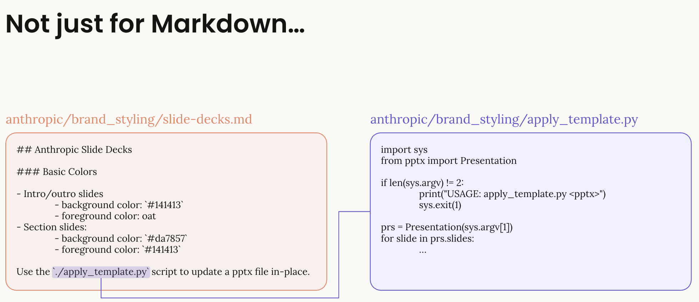

### Read these Docs first:

- [Agent Skills Overview](https://platform.claude.com/docs/en/agents-and-tools/agent-skills/overview) 
- [Best Practices](https://platform.claude.com/docs/en/agents-and-tools/agent-skills/best-practices)


## Skill Structure
Every custom skill follows this directory structure:
```
skill_name/
├── SKILL.md           # REQUIRED: Instructions with YAML frontmatter
├── *.md               # Optional: Any additional .md files (documentation, guides)
├── scripts/           # Optional: Executable code
│   ├── process.py
│   └── utils.js
└── resources/         # Optional: Templates, data files
    └── template.xlsx
```
Important:

- SKILL.md is the ONLY required file - everything else is optional
- Multiple .md files allowed - You can have any number of markdown files in the top-level folder
- All .md files are loaded - Not just SKILL.md and REFERENCE.md, but any .md file you include
- Organize as needed - Use multiple .md files to structure complex documentation


### Skills can bundle various file types:

- Markdown files: Instructions and documentation (SKILL.md, REFERENCE.md, etc.)
- Scripts: Python, JavaScript, or other executable code for complex operations
- Templates: Pre-built files that can be customized (Excel templates, document templates)
- Resources: Supporting data files, configuration, or 
assets
## SKILL.md Requirements
The SKILL.md file must include:

1. YAML Frontmatter (name: 64 chars, description: 1024 chars)

2. name: Lowercase alphanumeric with hyphens (required)
3. description: Brief description of what the skill does (required)
4. Instructions (markdown format):

- Clear guidance for Claude
- Examples of usage
- Any constraints or rules
- Recommended: Keep under 5,000 tokens
## Additional Documentation Files
You can include multiple markdown files for better organization:
```
skill_name/
├── SKILL.md           # Main instructions (required)
├── REFERENCE.md       # API reference (optional)
├── EXAMPLES.md        # Usage examples (optional)
├── TROUBLESHOOTING.md # Common issues (optional)
└── CHANGELOG.md       # Version history (optional)
```
All .md files in the root directory will be available to Claude when the skill is loaded.


### Directory Structure Best Practices
```
custom_skills/
├── financial_analyzer/       # Single purpose, clear naming
│   ├── SKILL.md             # Under 5,000 tokens
│   ├── scripts/             # Modular Python/JS files
│   └── tests/               # Unit tests for scripts
├── brand_guidelines/         # Organizational standards
│   ├── SKILL.md
│   ├── REFERENCE.md         # Additional documentation
│   └── assets/              # Logos, templates
```